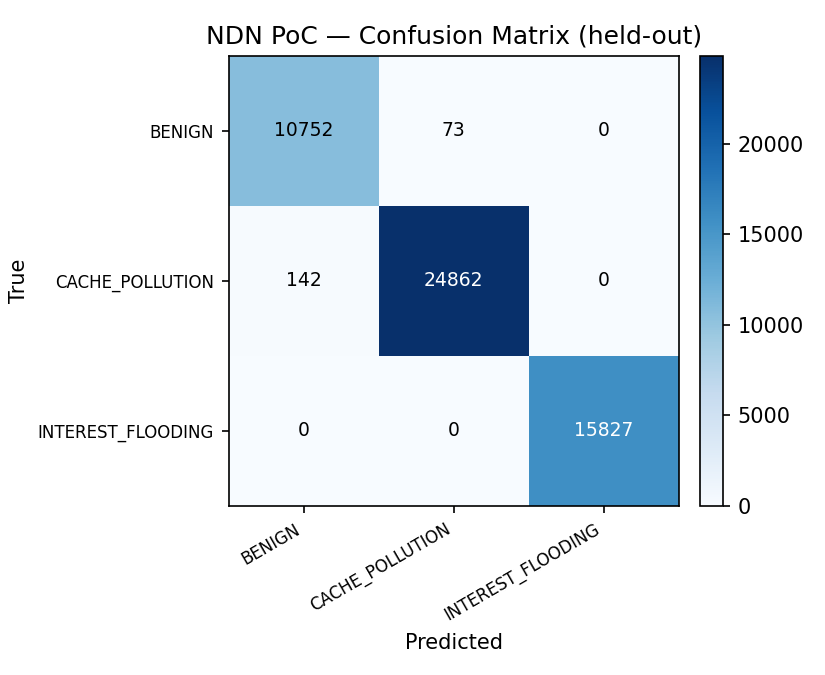

# Hybrid-Sentinel — NDN Proof-of-Concept

This module provides **direct, executable evidence for the NDN-native threat
claims** in the Hybrid-Sentinel paper (Interest Flooding against the Pending
Interest Table, Cache Pollution against the Content Store).

It is intentionally **separate** from the production IP-attack pipeline
(`src/`, `api/`). The production three-tier cascade is trained and evaluated on
real TCP/IP captures (SSH brute force, slow HTTP, HTTP flood, port scan, DNS
tunnelling). This module demonstrates that the *same behavioural-window detection
approach* transfers to **NDN forwarder state**, using a controlled discrete-event
NDN simulation.

## Why this module exists (scope & honesty)

The production dataset does **not** contain NDN packets — it is IP traffic. To
substantiate the paper's NDN motivation without overclaiming, this PoC:

1. Simulates the real NDN forwarding pipeline (PIT + Content Store + FIB).
2. Reproduces the two canonical NDN attacks with their **actual mechanisms**.
3. Extracts **NDN-native** features (PIT occupancy, CS hit ratio, name entropy,
   unsatisfied-Interest ratio, …) — not TCP/IP headers.
4. Trains a classifier and reports **held-out** metrics.

This is a **simulation**, not a live NFD/ndnSIM testbed. See *Limitations*.

## Architecture

```
consumers (Zipf-popular, satisfiable)  ┐
attacker  (Interest Flooding / Cache Pollution) ┼──▶  Monitored Router R  ──▶ Producer
                                                │      ├─ PIT (lifetime, timeouts)
                                                │      ├─ Content Store (LRU)
                                                │      └─ FIB (default route)
                                                ▼
                             per-packet observation log (Interest/Data + state)
                                                ▼
                             causal 17-feature vectors  →  20-packet windows
                                                ▼
                             RandomForest classifier (BENIGN / FLOOD / POLLUTION)
```

### Attack mechanisms (faithful to NDN literature)

| Attack | Mechanism in the simulator | Forwarder effect | Dominant signal |
|--------|----------------------------|------------------|-----------------|
| **Interest Flooding** | Interests for **unsatisfiable** unique names (`/prod/attack/...`); producer never returns Data | PIT entries linger until lifetime expiry → **PIT exhaustion** | `pit_size`↑, `unsatisfied_ratio_win`↑, `is_unsatisfiable`, `name_entropy`↑ |
| **Cache Pollution** | Interests for **valid but cold** names, uniformly random across the catalog | Junk evicts popular content → **CS hit ratio collapse** | `cs_hit_ratio_win`↓, `name_diversity_win`↑, `cs_size` churn |
| **Benign** | Zipf-popular, satisfiable Interests | High cache locality | high `cs_hit_ratio_win`, low `name_diversity_win` |

## The 17 NDN-native features

Deliberately parallels the production model's 17 IP features, but reads NDN state:

`is_interest, is_data, name_depth, name_entropy, is_new_name, is_unsatisfiable,
cs_hit, pit_aggregated, pit_size, pit_growth, cs_size, expired_since_last,
interarrival, interest_rate_win, cs_hit_ratio_win, unsatisfied_ratio_win,
name_diversity_win`

All features are **causal** (computed from past packets only), so the extractor
is deployable on a live forwarder.

## How to run

```bash
# 1) generate the NDN dataset (200 episodes per class)
python -m ndn_poc.generate_dataset --episodes 200 --out data/ndn

# 2) train + evaluate the PoC detector
python -m ndn_poc.train_poc --data data/ndn
```

Outputs:
- `data/ndn/ndn_windows.npy`, `ndn_labels.npy`, `ndn_meta.json`
- `models/ndn/ndn_poc_rf.pkl`, `ndn_poc_scaler.pkl`
- `results/ndn/ndn_metrics.json`, `ndn_confusion_matrix.png`

(Evidence copies committed under `docs/ndn_poc/`.)

## Results (held-out, 25% test split)

Dataset: **206,624** behavioural windows (43,299 BENIGN, 63,308 INTEREST_FLOODING,
100,017 CACHE_POLLUTION), 20 packets × 17 NDN features each.

| Metric | Value |
|--------|-------|
| Accuracy | **0.9958** |
| Macro-F1 | **0.9953** |
| Attack detection rate | **0.9965** |
| Benign false-positive rate | **0.0067** |

| Class | Precision | Recall | F1 |
|-------|-----------|--------|----|
| BENIGN | 0.987 | 0.993 | 0.990 |
| CACHE_POLLUTION | 0.997 | 0.994 | 0.996 |
| INTEREST_FLOODING | 1.000 | 1.000 | 1.000 |



Interest Flooding is perfectly separable (PIT-exhaustion + unsatisfiable-name
signature is unambiguous). The only residual confusion is a small overlap between
BENIGN and CACHE_POLLUTION during low-density attack-warmup windows — expected and
realistic.

## Limitations (state these in the paper)

- **Simulation, not a live testbed.** Traffic is generated by a discrete-event
  model, not captured from NFD or ndnSIM. Absolute numbers reflect the model's
  assumptions (Poisson arrivals, Zipf popularity, LRU CS, fixed PIT lifetime).
- **Two NDN attacks**, not the full NDN threat surface (no collusive/false-locality
  pollution, no NACK-based variants yet).
- **Single-router topology.** No multi-hop forwarding or distributed PIT effects.
- These results **complement**, and do not replace, the production cascade's
  results on real IP captures. The contribution here is showing the detection
  *methodology* transfers to NDN forwarder state.

## Suggested next step toward full validation

Reproduce these attacks on **ndnSIM** (NS-3) or a containerised **NFD** testbed,
log real PIT/CS counters, and retrain the extractor on captured traces. The
feature schema and model in this module are designed to port directly.
